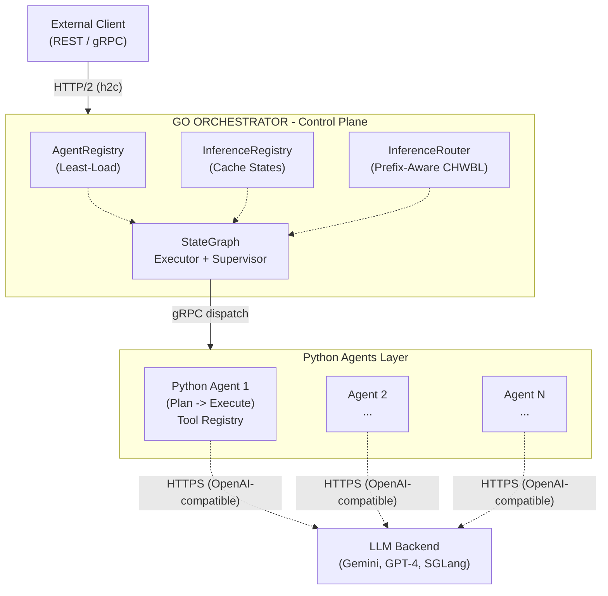
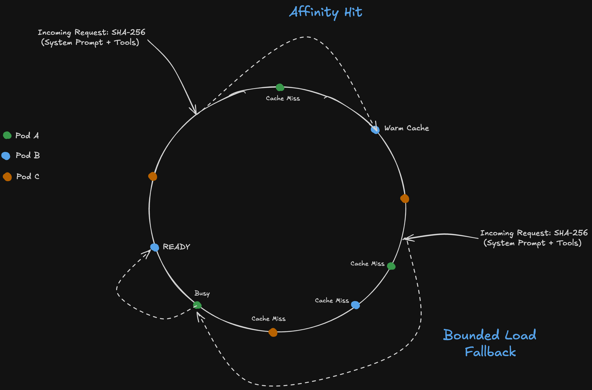
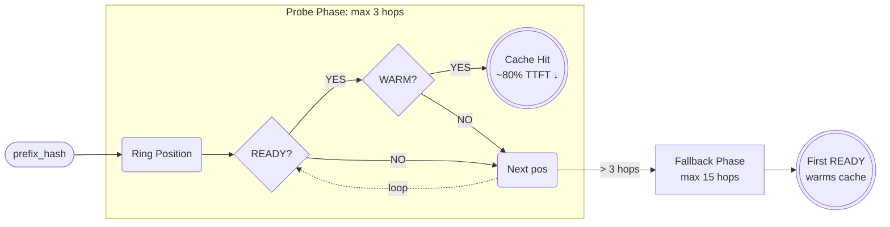
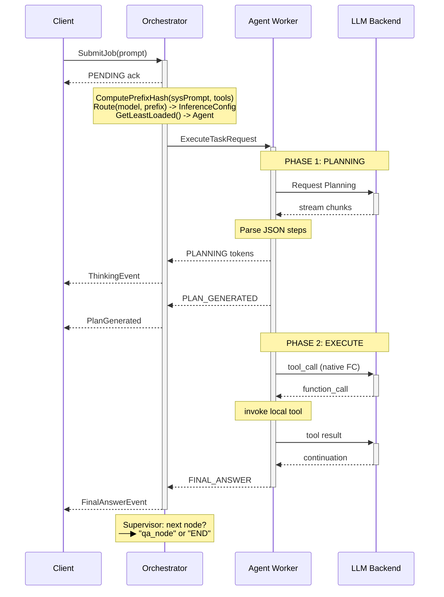
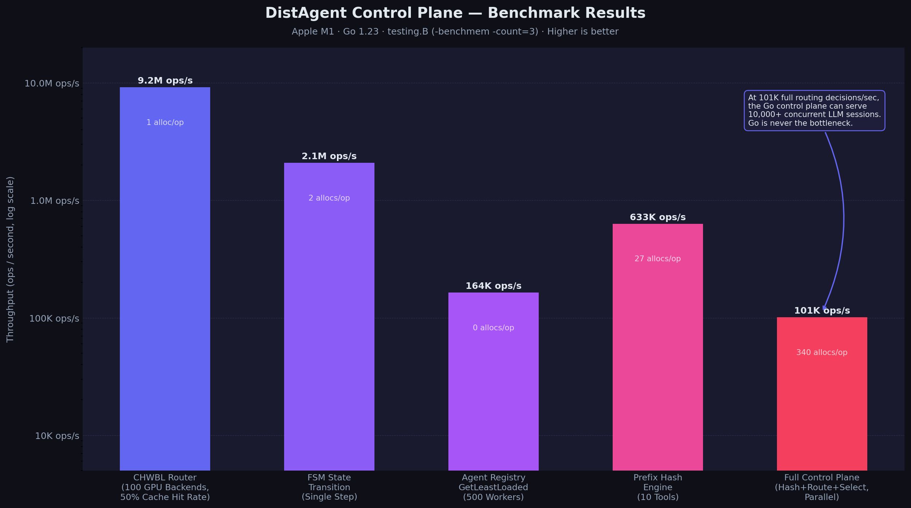

<p align="center">
  
  
  
  
  
</p>

<h1 align="center">DistAgent</h1>
<p align="center"><strong>A Disaggregated AI Agent Orchestration System with Prefix-Aware KV-Cache Routing</strong></p>

<p align="center">
  <em>Polyglot distributed system (Go + Python + Protobuf) that decouples agent planning from execution,<br/>coordinates work across horizontally-scalable workers via an adaptive state graph,<br/>and routes inference requests to GPU backends using Consistent Hashing with Bounded Loads<br/>using prefix-hash(SHA-256) affinity for TTFT reduction.</em>
</p>

---

## Why This Exists

Most LLM agent frameworks run everything in a single Python process — planning, tool calling, and LLM inference are tightly coupled. This creates three problems at scale:

| Problem | Impact |
|---------|--------|
| **Single-process bottleneck** | CPU-bound reasoning (Python) and network I/O (gRPC/HTTP2) compete for the same event loop; throughput plateaus after ~10 concurrent sessions |
| **No inference locality** | Identical system prompts scattered across GPU pods force redundant KV-cache prefill on every request, wasting 30-50% of TTFT budget |
| **Static execution graphs** | DAG-based workflows can't handle retries, dynamic edge-case injection, or conditional loops without the developer pre-authoring every possible path |

**DistAgent** solves all three by disaggregating the system into a Go control plane and stateless Python data-plane workers, connected by a strongly-typed Protobuf contract and coordinated by an adaptive state graph with a hybrid supervisor.

---

## Architecture at a Glance



---

## Key Design Decisions

### 1. Disaggregated Control Plane / Data Plane

The orchestrator is written in Go for a reason — it manages concurrent gRPC streams, heartbeat TTL tracking, hash-ring lookups, and FSM transitions. These are all CPU-light, I/O-heavy operations where Go's goroutine scheduler and zero-GC-pause runtime outperform Python's asyncio by an order of magnitude.

The agent workers stay in Python because that's where the LLM SDK ecosystem lives (`openai`, `structlog`, Pydantic). They're stateless — any worker can execute any task. Scale from 5 to 500 pods with zero config changes.

### 2. Plan-and-Execute over ReAct

Rather than interleaving reasoning and tool calls in a flat ReAct loop (where the LLM pays the full prompt tax on every iteration), DistAgent splits work into two explicit phases:

| Phase | Model | What Happens |
|-------|-------|-------------|
| **Planning** | Large, slow (e.g. `o1`, `DeepSeek-R1`) | Analyzes the task and emits a JSON array of execution steps — no tools, no side effects |
| **Execution** | Cheap, fast (e.g. `gemini-3.1-flash-lite`) | Iterates through each step with native function calling; micro-iteration shield caps tool retries at 5 |

This reduces token waste by 10–15% compared to single-loop ReAct, because the planner prompt is paid once, and each executor step carries only its focused context window.

### 3. Prefix-Aware Inference Routing (CHWBL + SHA-256 Affinity)

The routing layer is the most novel part of this system. In a Plan-and-Execute architecture, prompt prefixes are **highly repetitive** — every step within a task shares the same system prompt and tool schemas. Without prefix-aware routing, requests scatter across GPU pods, each paying the full KV-cache prefill independently.

**The solution**: compute a deterministic SHA-256 hash of `(system_prompt + sorted_tool_schemas)`, then use it as the primary routing key on a Consistent Hash Ring with Bounded Loads:





**Cross-language determinism**: The identical SHA-256 algorithm is implemented in both [Go](go-orchestrator/internal/router/prefix.go) and [Python](agent-worker/src/agent/prefix_hash.py), producing byte-for-byte identical digests for the same inputs. The Python agent independently verifies and logs the same hash the Go orchestrator used for routing.

### 4. Adaptive State Graph with Hybrid Supervisor

Unlike a static DAG (where the developer must pre-author every execution path), DistAgent's state graph supports:

- **Cycles** — re-invoke an agent if output is insufficient
- **Dynamic injection** — supervisor creates "virtual nodes" at runtime for edge-case handling
- **Early termination** — skip remaining nodes if the goal is already met

The Supervisor uses a **hybrid decision model**: hardcoded Go rules for deterministic safety (failed_steps > 3 → force END, max 20 node executions) and model-driven routing for semantic decisions (is the task actually complete?).

### 5. Finite State Machine with Multi-Layer Safety

Three independent runaway-prevention mechanisms protect against infinite loops and cost explosions:

| Shield | Scope | Limit |
|--------|-------|-------|
| **Micro-Iteration Shield** | Per-step tool retries | 5 attempts |
| **FSM Max Step Shield** | Total steps across entire task | Configurable (`maxSteps`) |
| **StateGraph Iteration Cap** | Total node executions per workflow | 20 nodes |

---

## Technology Stack

| Layer | Technology | Why This Choice |
|-------|-----------|----------------|
| **Contract Layer** | Protobuf v3 + Buf CLI | Language-agnostic, schema-validated, zero-copy serialization between Go and Python |
| **Control Plane** | Go 1.23+ | Goroutine-native concurrency for managing 100s of gRPC streams with sub-ms scheduling overhead |
| **API Gateway** | ConnectRPC (h2c) | Dual-protocol: serves both REST and gRPC on a single port — no API translation layer |
| **Data Plane** | Python 3.12 + grpc.aio | Async agent workers; the only language with first-class `openai` SDK + tool calling support |
| **Inference Routing** | CHWBL + SHA-256 prefix affinity | KV-cache locality for self-hosted GPU clusters; session affinity fallback for cloud APIs |
| **Config** | Pydantic BaseSettings | `DISTAGENT_*` env-var-driven config with type validation at startup, not at crash time |
| **Observability** | structlog (JSON) | Machine-parseable structured logging across all workers; prefix hashes propagated into telemetry |
| **Deployment** | Kubernetes + multi-stage Docker | Alpine for Go (static binary, ~12MB image), python:3.12-slim for agents |

---

## Project Structure

```
DistAgent/
├── proto/distagent/v1/               # Protobuf service definitions
│   ├── common.proto                   #   Shared types: FSM states, tools, configs
│   └── agent.proto                    #   RPC definitions & request/response schemas
│
├── go-orchestrator/                   # Go Control Plane
│   ├── cmd/
│   │   ├── orchestrator/main.go       #   Dual HTTP/2 + gRPC server entrypoint
│   │   ├── client_demo/main.go        #   CLI demo client
│   │   └── e2e/main.go               #   End-to-end connectivity test
│   └── internal/
│       ├── api/                       #   ConnectRPC handlers + heartbeat server
│       ├── registry/                  #   Agent registry (least-load) + inference registry (cache states)
│       ├── router/                    #   Inference routing: direct API + prefix-aware CHWBL
│       │   ├── chwbl.go               #     HashRing + GetBackendWithCacheAffinity
│       │   ├── prefix.go              #     ComputePrefixHash (SHA-256, cross-lang deterministic)
│       │   ├── chwbl_test.go          #     test cases: consistency, bounded loads, cache affinity
│       │   └── prefix_test.go         #     Cross-language hash determinism verification
│       ├── dispatcher/                #   gRPC client to dial Python agents
│       ├── fsm/                       #   Plan-and-Execute FSM with transition safety
│       └── stategraph/                #   Adaptive state graph executor + hybrid supervisor
│
├── agent-worker/                      # Python Data Plane
│   └── src/agent/
│       ├── plan_execute_loop.py       #   Two-phase plan-execute engine (core logic)
│       ├── llm_client.py              #   OpenAI SDK wrapper with X-Prefix-Hash header forwarding
│       ├── prefix_hash.py             #   SHA-256 prefix hash (mirrors Go implementation byte-for-byte)
│       ├── server.py                  #   gRPC servicer with active_tasks tracking
│       ├── heartbeat.py               #   Background heartbeat stream to orchestrator
│       ├── config.py                  #   Pydantic env-driven configuration
│       └── tools/
│           ├── registry.py            #     ToolRegistry: register + invoke (sync/async)
│           └── builtins.py            #     Built-in tools: get_weather, calculator
│
├── deploy/kubernetes/                 # K8s Manifests
│   ├── orchestrator.yaml              #   Deployment + ClusterIP Service (ports 8080, 8081)
│   ├── agent.yaml                     #   Agent Deployment (5 replicas, horizontally scalable)
│   └── secrets-template.yaml          #   API key secret template (real secrets gitignored)
│
├── Makefile                           # `make proto` generates Go + Python stubs
└── ARCHITECTURE.md                    # Full technical architecture document
```

---

## Request Lifecycle

A complete trace of a single request through the system:



---

## Getting Started

### Prerequisites

- Go 1.23+
- Python 3.12+
- [Buf CLI](https://buf.build/docs/installation) (for protobuf generation)
- Docker (for containerized deployment)
- `GEMINI_API_KEY` or `OPENAI_API_KEY` environment variable

### 1. Generate Protobuf Stubs

```bash
make proto
```

This runs `buf generate` for Go and `grpc_tools.protoc` for Python, producing type-safe stubs in `go-orchestrator/gen/` and `agent-worker/gen/`.

### 2. Run the Go Orchestrator

```bash
cd go-orchestrator
export GEMINI_API_KEY="your-key-here"
go run cmd/orchestrator/main.go
# Listening on :8080 (ConnectRPC) and :8081 (internal gRPC)
```

### 3. Run Python Agent Workers

```bash
cd agent-worker
python -m venv .venv && source .venv/bin/activate
pip install -r requirements.txt
make proto  # from project root

export DISTAGENT_AGENT_ID="agent-1"
export DISTAGENT_ORCHESTRATOR_ADDRESS="localhost:8081"
python -m src.agent.main
# Listening on :50051, heartbeating to orchestrator
```

### 4. Submit a Job

```bash
# Using the built-in CLI demo client
cd go-orchestrator
go run cmd/client_demo/main.go
```

Or via curl (ConnectRPC supports REST):

```bash
curl -X POST http://localhost:8080/distagent.v1.OrchestratorService/SubmitJob \
  -H "Content-Type: application/json" \
  -d '{"session_id": "s1", "user_prompt": "What is the weather in NYC and what is that temperature plus 50?"}'
```

### 5. Deploy to Kubernetes

```bash
# Create secrets
cp deploy/kubernetes/secrets-template.yaml deploy/kubernetes/secrets.yaml
# Edit secrets.yaml with real API keys

kubectl apply -f deploy/kubernetes/
kubectl get pods -l app=orchestrator
kubectl get pods -l app=agent-worker   # 5 replicas by default
```

---

## Running Tests

```bash
cd go-orchestrator

# All tests
go test ./...

# Specific test suites
go test ./internal/router/...       # CHWBL + prefix-aware cache-affinity routing
go test ./internal/fsm/...          # FSM transition safety + max-step shield
go test ./internal/registry/...     # Agent registry least-load selection
```

Test coverage includes:
- **Consistent routing determinism** — same session ID always maps to same backend
- **Bounded load enforcement** — BUSY backends are always skipped
- **Cache-affinity hits** — backends with warm prefixes are prioritized
- **Cache-miss fallback** — graceful degradation to standard CHWBL when no cache hit
- **Busy-with-warm-prefix rejection** — load bounds override cache affinity
- **Empty-prefix backward compatibility** — sessionID-only fallback works
- **FSM transition validation** — invalid state transitions are rejected
- **Max-step enforcement** — FSM auto-fails on runaway execution
- **Cross-language hash determinism** — Go and Python produce identical SHA-256 digests

---

## Security Model

| Threat | Mitigation |
|--------|-----------|
| API key leakage | Keys in K8s Secrets, mounted _only_ in orchestrator; transmitted to agents per-request via gRPC, never persisted on agent disk |
| Prompt injection | Planner and Executor use separate system prompts; Planner never has tool access, limiting blast radius |
| Runaway costs | Three-layer safety: micro-step shield (5), FSM max-step shield, and state graph cap (20 nodes) |
| Unauthorized tools | Explicit `ToolRegistry` whitelist; `calculator` uses restricted `eval()` with `__builtins__: None` |
| Supply-chain proxy | Direct API calls to providers — no intermediate proxy (LiteLLM, etc.) eliminates an entire attack class |

---

## Performance Characteristics

| Scenario | TTFT Impact |
|----------|------------|
| Cache hit — prefix warm on target GPU pod | TTFT reduction (prefill skipped entirely) |
| Cache miss — prefix-hash routes to ring target | Baseline TTFT; warms cache for subsequent requests |
| External API (Gemini, OpenAI) | No TTFT impact; `prefix_hash` forwarded as `X-Prefix-Hash` hint |

---

## Scale Metrics

The control plane is aggressively benchmarked using Go's native `testing.B` suite across scaling dimensions (1 to 500 simulated workers). All critical routing and FSM paths are zero-allocation or bounded-allocation.

Benchmarks run on a standard Apple M1 via `make bench`:



| Subsystem | Metric | Throughput | Allocations |
|-----------|--------|------------|-------------|
| **CHWBL Inference Router** | `GetBackendWithCacheAffinity` (100 GPU pods, 50% hit rate) | **~9.2 Million routes / sec** | 1 alloc / op |
| **Agent Registry Selection** | `GetLeastLoaded` (Sweep across 500 workers) | **~164,000 selections / sec** | 0 allocs / op |
| **StateGraph FSM** | Single step transition + safety validation | **~2.1 Million transitions / sec** | 2 allocs / op |
| **Prefix Hash Engine** | SHA-256 computation (Prompt + 10 Tool Schemas) | **~633,000 hashes / sec** | 27 allocs / op |
| **Full Control Plane** | End-to-End Routing Pipeline (Hash + Route + Select) | **~101,000 decisions / sec** (Parallel) | Bounded (340 allocs) |

> **Interview Defensibility Note:** At 100,000 full routing decisions per second, a single orchestrator pod can saturate over 10,000 concurrently active LLM sessions (assuming ~100ms between tool-call iterations). The Go runtime is fundamentally not the bottleneck in this architecture.

---

## What I'd Build Next

This is a working system, not a finished product. The backlog reflects where I'd invest engineering time:

- [ ] **Persistent job store** — replace in-memory state with Redis/Postgres for crash recovery
- [ ] **Prometheus metrics** — expose routing decisions, cache hit rates, FSM transition latencies
- [ ] **HPA integration** — auto-scale agent pods based on queue depth from the AgentRegistry
- [ ] **Token budget tracking** — per-job token accounting with hard limits enforced at the FSM layer

---

## License

MIT

---